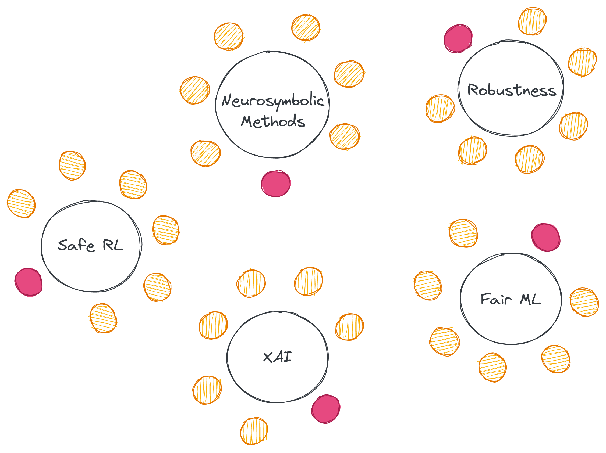

<link rel="stylesheet" href="https://maxcdn.bootstrapcdn.com/font-awesome/4.6.0/css/font-awesome.min.css">

## 
Interactive Program

### Goals: Networking and Collaboration

### Schedule

| Time | Type | Activity | Location |
| -------- | :--------: | -------- | -------- | 
| <i class="fa fa-hourglass fa-fw"></i>  | <i class="fa fa-slideshare fa-fw"></i>  | 60-min keynote | Zoom |
| <i class="fa fa-hourglass-start fa-fw"></i>  | <i class="fa fa-slideshare fa-fw"></i>  | 15-20-min problem presentation | Zoom |
| <i class="fa fa-hourglass-half fa-fw"></i>  | <i class="fa fa-group fa-fw"></i>  | 20-min facilitated discussion tables | Gather.Town |
| <i class="fa fa-hourglass-end fa-fw"></i> | <i class="fa fa-flash fa-fw"></i>  | 10-min break/3-min networking | Breakout Room |
| <i class="fa fa-hourglass-half fa-fw"></i> | <i class="fa fa-group fa-fw"></i>  | 20-min facilitated discussion tables | Zoom|
| <i class="fa fa-hourglass fa-fw"></i> | <i class="fa fa-slideshare fa-fw"></i>  | Poster session | Gather.Town|

### 
Facilitated discussion tables  <i class="fa fa-group fa-fw"></i> 

### Topics & Facilitators

    
| Topics | Speaker | Role |
|:------------------------------------------------------------------------------------ |:----------------:|:---------------:|:----------:|:-----------:|
| Artificial Intelligence | [Sheila McIlraith](https://www.cs.toronto.edu/~sheila/) | Keynote |
| Explainable Artificial Intelligence | [Ofra Amir](https://scholar.harvard.edu/oamir/home) | Facilitator |
| Robustness of Neural Networks| [Guy Katz](https://www.katz-lab.com/) | Facilitator |
| Neurosymbolic Methods| [Markus Rabe](https://dblp.org/pid/88/1112-2.html) | Facilitator |
| Safe Reinforcement Learning | [Matthijs Spaan](https://www.st.ewi.tudelft.nl/mtjspaan/) | Facilitator |
| Fair Machine Learning | [Aws Albarghouthi](http://pages.cs.wisc.edu/~aws/)  | Facilitator |
